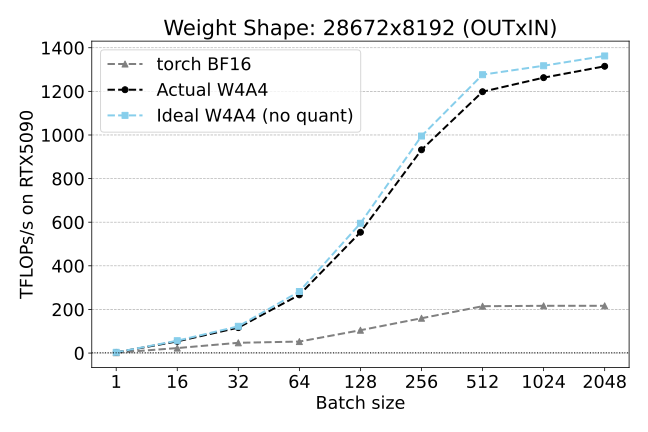

# QuTLASS v0.1.0
[](https://opensource.org/licenses/Apache-2.0)
[](https://www.python.org/downloads/)
[](https://developer.nvidia.com/cuda-toolkit)
[](https://github.com/NVIDIA/cutlass)
[](https://download.pytorch.org/whl/nightly/cu128)

QuTLASS is a high-performance library designed for low-precision kernel support in deep learning quantization, built on top of [NVIDIA CUTLASS](https://github.com/NVIDIA/cutlass).

QuTLASS v0.1.0 introduces 4-bit microscaling routines tailored for Large Language Model (LLM) inference on NVIDIA Blackwell GPUs.

<a href='https://arxiv.org/pdf/2509.23202'></a> &nbsp; 

### Microscaling in Blackwell
The new Blackwell architecture supports native matrix multiplication with microscaling, using scale factors in the form:
$D = C + (A \times \mathrm{SFA}) \cdot (B \times \mathrm{SFB})$

Here, the scale factors are applied along the inner ($K$) dimension of the GEMM.
For instance, for MXFP types, a scale factor is shared by every $32$ elements along $K$ (group size $gs=32$).
Thus, for an $M \times K$ matrix $A$, the corresponding scale matrix $\mathrm{SFA}$ has dimensions $M \times \left\lceil K / gs \right\rceil$.

### 🚀 What is new in QuTLASS v0.1.0:
- Support for ```sm_100``` GPUs (e.g., NVIDIA B200).
- NVFP4 Microscaling:
    - Full W4A4 quantization support.
    - Online rotations:
        - Fused transform + quantization + scale computation.
        - Rotation matrices loaded at runtime, allowing any transformation to be applied.
    - NVFP4 Matmul Kernels:
        - CUTLASS-backed NVFP4:NVFP4 with block-scale reordering.
    - Quantization:
        - Abs-Max supported.
- Multiple rotation sizes (16/32/64/128) supported for both MXFP4 and NVFP4.
- vLLM Integration ([PR #24440](https://github.com/vllm-project/vllm/pull/24440))

### Features from QuTLASS v0.0.1:
- MXFP4 microscaling support, with
- Weight and Activation quantization (W4A4)
- *Online rotations*: fused kernel for online transforms, quantization, and scale computation.
    - Transformations matching the microscaling group sizes (i.e., 32 for MXFP4).
    - Compatible with any rotation matrix defined (e.g., Identity, Hadamard, DCT), as they are loaded in runtime.
- Multiple quantization schemes:
    - [Quartet](https://arxiv.org/pdf/2505.14669) (i.e., [Quest-like](https://arxiv.org/abs/2502.05003)).
    - Abs-Max.
- Matmul kernels:
    - CUTLASS-backed MXFP4:MXFP4 kernel with block-scale reordering.
    - Prototype kernel for small batch sizes (no reordering required).
- Transformers Integration ([PR #38696](https://github.com/huggingface/transformers/pull/38696))

**Note**: QuTLASS is still under *active development* and not yet fully optimized.

## Getting Started

### Requirements:

- **NVIDIA Blackwell GPU** (Compute capabilities supported: `sm_120a` and `sm_100a`)
- **CUDA 12.8** compatible drivers

### Installation:

1. Install PyTorch nightly with CUDA 12.8 support:

```bash
pip install --pre torch torchvision torchaudio --index-url https://download.pytorch.org/whl/nightly/cu128
```

2. Install QuTLASS (in editable mode):

```bash
pip install --no-build-isolation -e .
```

in the root folder of this repository.

### Usage example

Correctness tests can be executed via ```python tests/mxfp4_test.py``` and benchmarks via ```python benchmarks/bench_mxfp4.py```.

The fused quantization kernel can be invoked directly through ```qutlass.fusedQuantizeMx(a, h, method)```. Here, ```a``` is the input tensor to quantize, ```h``` is the Hadamard matrix, and ```method``` is the quantization scheme specified as ```Literal["quest", "abs_max"]```.
The kernel interface is defined in ```qutlass/csrc/fused_quantize_mx.cu```.
The outputs include ```aq```, the quantized data in FP4 (```e2m1```), and ```a_sf``` the corresponding scaling factors in FP8 (```e8m0```).

The matmul kernel can be called via ```qutlass.matmul_mxf4_bf16_tn(aq, bq, a_sf, b_sf, alpha)```. Its implementation can be found in ```qutlass/csrc/gemm.cu```.
To use this matmul kernel, the scaling factors must be first rearranged into a block-scaled swizzle [format](https://docs.nvidia.com/cuda/cublas/index.html#d-block-scaling-factors-layout).
The ```qutlass.to_blocked```, located in ```qutlass/utils.py```, handles this reordering.

In addition to the previous CUTLASS-powered MXFP4 matmul kernel, we provide a custom prototype kernel that can be called via ```qutlass.matmul_ada_mxf4_bf16_tn(...)```.
This implementation is located in ```qutlass/csrc/gemm_ada.cu``` and does **not** require the previous invocation to ```to_blocked```.
Optimization efforts for this kernel have primarily targeted small batch sizes(i.e., $bs=1\sim 32$). For larger sizes, ```qutlass.matmul_mxf4_bf16_tn``` is recommended.

This applies also to NVFP4, which is functionally equivalent aside from minor naming changes.

# Benchmarks

### Microbenchmarks
The following illustrate the performance of QuTLASS MXFP4 across various batch sizes.
Ideal performance refers to pure matrix multiplication in FP4, without any overhead from quantization.
Actual performance includes the full pipeline: Hadamard rotation, data quantization, scale computation, and block-scale reordering.

<div class="row"><center>
  <div class="column">
    
    
  </div>
  <em>QuTLASS performance on a single Qwen3-32B layer with NVIDIA RTX5090 GPU</em>
 </center>
</div>
</br>
<div class="row"><center>
  <div class="column">
    
    
  </div>
  <em>QuTLASS performance on a single Llama-3.1-70B layer with NVIDIA B200 GPU</em>
 </center>
</div>

### End-to-end speedups
The following results show the inference speedup of QuTLASS MXFP4 over PyTorch BF16 in Transformers, as a function of batch size and sequence length on 8B and 14B-parameter models.
MXFP4 delivers consistent performance gains across all batch sizes, with speedups increasing progressively and peaking at $\approx 4\times$ compared to BF16.

<div class="row"><center>
  <div class="column">
    
  </div>
 </center>
</div>

<div class="row"><center>
  <div class="column">
    
  </div>
 </center>
</div>

In order to generate recipes for efficient and accurate weight + activation quantization for low-bit MXFP formats, please refer to [FP-Quant](https://github.com/IST-DASLab/FP-Quant).

## Citation

```bibtex
@misc{qutlass2025,
      title={QuTLASS: CUTLASS-Powered Quantized BLAS for Deep Learning},
      author={Roberto L. Castro, and Dan Alistarh},
      year={2025},
      publisher = {GitHub},
      howpublished = {\url{https://github.com/IST-DASLab/qutlass}},
}
```
